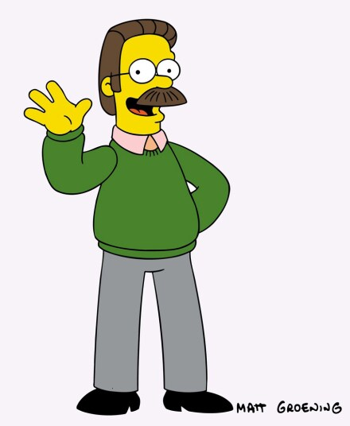
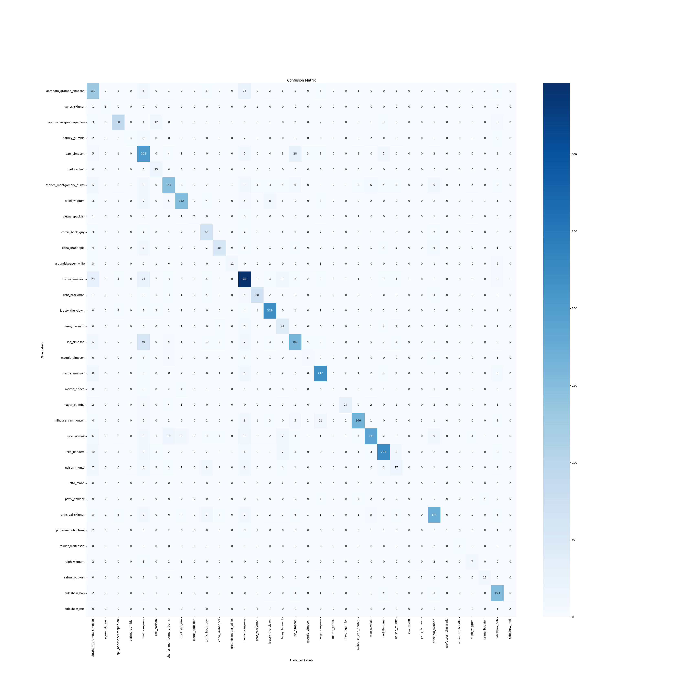
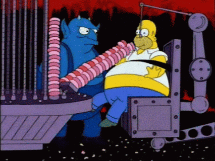

# Assignment 4 - Simpsons Character Face Classification using Neural Networks (self-assigned)
---
## introduction

 Hidly Ho Neighborino and welcome to the wacky world of Simpsons! In this code, we embark on an exciting adventure to train a neural network capable of distinguishing one Springfield resident from another. That's right, we're building a state-of-the-art system to classify the iconic faces of "The Simpsons" characters. You might be reading this wondering, why the simpsons? Well, based on expectations "The Simpsons" characters offer a unique advantage - their faces are relatively easy to differentiate. The characters all look like caricatures  and are also colored yellow meaning that with convolutional layers as a guide, i hope to be able to unlock the ability to differentiate between Ned Flanders wholesome smile and Mr. Burns nefarious scowl. furthermore simpsons is also so widely known that when we think of lisa or bart, we can visualize them quite easily. This means that we do not have to do too much explaining of the characters looks. 

## data
The dataset comprises a diverse range of Simpson character face images. in total 20689 images in 39 different folders each after one character. the dataset can be found at https://www.kaggle.com/datasets/alexattia/the-simpsons-characters-dataset. Please note that the creator by accident accidentally copied the entire folder into his list of characters. Meaning that there is another folder inside the folder that is just a copy of the rest. Naturally do not include this. The dataset also includes a bunch of characters with very few images, such as "troy maclure" with 8 images. I have chosen to get rid of some folders due to extremely low amount of images. the following was removed for having super small image amounts. many of the characters sport low amount of photos, but these are so outrageous that its not even possible to divide them into test and split datasets (less than 10 images)

[Troy mcclure, miss hoover, lionel hutz, gil, fat tony, disco stu, waylon smithers, snake_jailbird]  

after deleting the following we end up with 34 folders with 20607 images total. 

## model
This time i am  not using any preexisting model like in the past assignements.

To tackle this classification, we employ a convolutional neural network (CNN) architecture. CNNs are very effective in image recognition due to their ability to learn spatial hierarchies of features. 
The dataset is divided into training and validation sets before the model is trained in order to assess the effectiveness of the model. 

After training, we generate predictions for each sample to assess the model's performance on the validation set. In order to provide a classification report that includes metrics like precision, recall, and F1-score for each class, we translate the categorical predictions back into their respective labels.

We also create a confusion matrix to display the predictions of the model. This matrix offers a thorough analysis of the model's performance, pointing out any trends or incorrect classifications.

## script function
1. importing necessary libraries
2. The hyperparameters for the model are then defined, including batch size, number of classes (Simpsons characters), number of epochs, input shape (image dimensions), and validation split ratio.
3. next, the neural network model is created
4. the data is loaded and preprocessed using the tensorflow ImageDataGenerator.
5. then the model is trained and a history is generated.
5. Generates a classification report that includes evaluation metrics for  predictions. This report is saved in the out folder.
6. also generates a confusion matrix and saves it in the out folder.

### copy the repository 
git clone https://github.com/Olihaha/Assignment4
make sure to be in correct directory
(cd assignment4-simpsons-faces)

### how to replicate 
1. run the setup setup.sh first creating a venv and installing dependencies before deactivating itself.
2. run either setupmodel.sh or validate.sh.
setupmodel.sh trains a new model similar to already done.
validate.sh tests and visualizes the capabilities of the model.
(validate.sh allows usage of preexsting model created to avoid time generating a new one)
3. If orginally setupmodel.sh was run, run validate.sh 

### directory
Make sure that the repository has the following structure and that when running the script you are in the correct directory. 
Make sure that the simpsons_dataset is in assignemnet4 directory. and that all of the characters mentioned above have their folders removed.

## Results and findings
The original model created had an insane 99,8% accuracy on the testset but only 71% on the validation set which is a clear indication of overfitting. Overfitting occurs when the model is so trained/specialised in dealing with the original dataset that it struggles dealing with new images. If the model has looked at 50 pictures of homers face all looking the same, it will start to identify stuff thats unique to each picture resulting in a struggle on the validation fit. I suspect that this is happening due to a lack of dataset, some of the characters we were working with only had around 30-40 pictures of their faces meaning that the machine will clearly take biases.
Nevertheless, a 71% accuracy doe not sound so bad when we look at how many of the characters who in the validation set show up with less than 10 pictures.

### Classification report  
                          precision    recall  f1-score   support

    abraham_grampa_simpson       0.51      0.73      0.60       182
           agnes_skinner       0.50      0.38      0.43         8
    apu_nahasapeemapetilon       0.80      0.73      0.76       124
           barney_gumble       0.36      0.19      0.25        21
            bart_simpson       0.52      0.75      0.61       268
            carl_carlson       0.36      0.79      0.49        19
    charles_montgomery_burns       0.69      0.62      0.65       238
            chief_wiggum       0.81      0.77      0.79       197
         cletus_spuckler       0.67      0.22      0.33         9
          comic_book_guy       0.58      0.71      0.64        93
          edna_krabappel       0.75      0.60      0.67        91
    groundskeeper_willie       0.79      0.46      0.58        24
           homer_simpson       0.71      0.77      0.74       449
           kent_brockman       0.83      0.69      0.75        99
        krusty_the_clown       0.84      0.91      0.87       241
           lenny_leonard       0.47      0.66      0.55        62
            lisa_simpson       0.70      0.60      0.65       270
          maggie_simpson       0.29      0.20      0.24        25
           marge_simpson       0.83      0.84      0.84       258
           martin_prince       0.00      0.00      0.00        14
            mayor_quimby       0.82      0.55      0.66        49
     milhouse_van_houten       0.88      0.77      0.82       215
             moe_szyslak       0.86      0.66      0.74       290
            ned_flanders       0.82      0.77      0.80       290
            nelson_muntz       0.34      0.24      0.28        71
               otto_mann       0.00      0.00      0.00         6
           patty_bouvier       0.20      0.07      0.11        14
       principal_skinner       0.75      0.73      0.74       238
    professor_john_frink       1.00      0.08      0.14        13
      rainier_wolfcastle       0.67      0.44      0.53         9
            ralph_wiggum       0.39      0.41      0.40        17
           selma_bouvier       0.60      0.60      0.60        20
            sideshow_bob       0.74      0.87      0.80       175
            sideshow_mel       0.50      0.25      0.33         8

                accuracy                           0.71      4107
               macro avg       0.61      0.53      0.54      4107
            weighted avg       0.72      0.71      0.71      4107

When looking at the classifcation report we can also clearly see that some of the characters drag the accuracy down significantly. as stated earlier 5 of the characters have less than 10 images in the validation set, an outrageously low amount. 

### confusion matrix

When looking at the confusion matrix i would argue that it displays that our model is not extremely bad given how many of the characters along the ideal corner to corner row have such few images that its not even possible to draw a line. But, if we were to comment on the dataset there are some interesting finds.
First, homer and his dad are occasionally guessed to be the same character which in some weird wholesome way makes sense.
On the other hand, lisa and bart are confused occasionally which i would argue is most likely due to them often when training the data being in the same images.
third, our model struggles a lot to pinpoint Maggie, which seem strange given when examining the imageset she has a pacifier in her mouth in a significant amount of the images which should be a dead giveaway? probably an error similar to bart and lisa where maggie is rarely seen on her own.

### Hindsight
When looking at the loss and accuracy history we also see clearly that 20 epochs is definitely not needed and instead just increases the loss more than anything. I should have definitely included a function to stop early something like "tf.keras.callbacks.EarlyStopping(monitor='val_loss', patience=4)" which would have stopped with increasing val_loss values but even so, the difference in accuracy between epoch 20 and 10 is quite small meaning we would end up with a similar result anyway. 

visual representation of force feeding the model more and more epochs even if it is already more than full  
